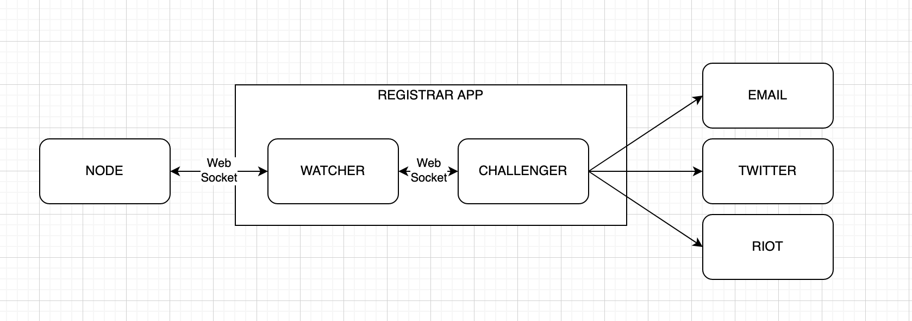

[](https://circleci.com/gh/w3f/polkadot-registrar-watcher)

# Polkadot-Registrar-Watcher

This application is the **Watcher** module of the **Polkadot-Registrar** application.    
You can find the **Challenger** module here: https://github.com/w3f/polkadot-registrar-challenger  
Watcher and Challenger modules together compose the **Polkadot-Registrar** application.

## Application Architecture



## About the Polkadot Identity Naming System

Polkadot provides a naming system that allows participants to add personal information to their on-chain account and subsequently ask for verification of this information by registrars.
Reference: https://wiki.polkadot.network/docs/en/learn-identity

## Table Of Contents

* [The Watcher Functionalities](#the-watcher-functionalities)
* [Requirements](#requirements) 
* [How To Run](#how-to-run)
* [How To Configure the Application](#how-to-configure-the-application)
* [About WsPendingChallengesRequest](#about-wspendingchallengesrequest)
* [WebSocket DTOs - the most important ones](#WebSocket-DTOs-\--the-most-important-ones)
* [Communication / Events flow](#communication-/-events-flow)

## The Watcher Functionalities

After having enstablished a connection with a Substrate based node (WebSocket endpoint), the Registrar Watcher Application is capable of providing these four main services:  

1. Provide on demand: an array containing all the current pending JudgementRequest(s) directed to the registrar (configurable index). The Challenger module is supposed to handle these requests.  
2. Detect and handle identity related events (such as new JudgementRequest: https://polkadot.js.org/docs/substrate/events#judgementrequestedaccountid-registrarindex) from the blockchain: the Challenger module will be eventually notified.
3. Host a WebSocket server, which the Challenger module can rely on to communicate
4. Sign and submit judgement extrinsics (i.e. Reasonable,Erroneous,...)
    * It is raccomended to configure the application to host an account that proxies the registrar account, for the sake of an increased security: https://wiki.polkadot.network/docs/en/learn-proxies

## Requirements
* yarn: https://classic.yarnpkg.com/en/docs/install/

## How To Run

```bash
git clone https://github.com/w3f/polkadot-registrar-watcher.git
cd polkadot-registrar-watcher
cp config/main.sample.yaml config/main.yaml #create the default config file
#just the first time

yarn
yarn build

yarn start # it will take the config file from config/main.yaml
# or
yarn start -c yourConfigPath/yourConfig.yaml
```

## How To Configure the Application

You can find a sample of the yaml config file [here](config/main.sample.yaml)

```yaml
node:
  enabled: true # you can disable the substrate node connectivity, maybe for testing purposes
  endpoint: "wss://kusama-rpc.polkadot.io/"
port: 3000 # Http port, you can extract Prometheus metrics for example: localhost:3000/metrics
portWs: 3001 # Web Socket, Challenger needs to connect here
logLevel: info
registrar:
  index: 0
  proxy:
    enabled: true # proxy functionlity discussed above
    primaryAccount: xxxx
  keystore:
    walletFilePath: /Users/xxx/xxx/5GpmfR5PWHX3x1X6wsZhDdpN1F4UKUYPr6mgPZKqLiJRgp5q.json
    passwordFilePath: '/Users/xxx/xxx/password'
```

## About WsPendingChallengesRequest

This WebSocket callable method provides the instant situation of the JudgementRequests directed to our registrar.

It is absolutely necessary to call this method to synchronize the watcher and the challenger, and after that the challenger can safely keep listening to the new events provided by the watcher.

By synchronize it is meant: the set of the accountId that the challenger is handling has always to be as close as possible to the one of the blockchain. The blockchain is providing the set of all the open JudgementRequest we need to handle.

It is necessary to call this method when:
* (challenger startup)
* (challenger loose connection, as soon it is re enstablished)
* (watcher loose connection, as soon it is re enstablished)
* ... so we can condense all them three above and say: **always after a connection enstablished event**
* **the point above cover also both the watcher and the challenger crush/offline -> restart**

It is suggested to call this method when:
* repeatedly after a configurable amount of time, to be sure the synchronization between the two module is optimal

## WebSocket DTOs - the most important ones

( [here](src/types.ts) you can find them all )

```typescript
export interface WsAck {
  event: 'ack';
  data: {
    result: string;
    address?: string;
  };
}

export interface WsErrorMessage {
  event: 'error';
  data: {
    error: string;
  };
}

export const connectionEstablished: WsAck = {
  event:'ack',
  data:{
    result: 'connection Established'
  }
}

export const messagAcknowledged: WsAck = {
  event:'ack',
  data:{
    result: 'message acknowledged'
  }
}

export interface WsChallengeRequestData {
  address: string;
  accounts: { matrix?: string; email?: string; twitter?: string };
}

export interface WsChallengeRequest {
  event: 'newJudgementRequest';
  data: WsChallengeRequestData;
}

export interface WsChallengeResponse {
  event: 'judgementResult';
  data: JudgementResult;
}

export enum JudgementResult{
  erroneous,
  reasonable
} 

export interface WsJudgementResult{
  address: string;
  judgement: string;
}
```

## Communication / Events flow

* Ack message after each Request/Response message 
* Ack connection enstablished after the initial connection setup
* Ack error after a communication or a wrong format error
* **NewJudgementRequest** detected ( Watcher ) -> **WsChallengeRequest** sent to the Challenger
* New **IdentitySet** detected during a pending Judgemet Request ( Watcher ) -> **WsChallengeRequest** sent to the Challenger
* Challenger module detects a challenge completed -> **WsChallengeResponse** sent to the Watcher
* Challenger can always send a **WsPendingChallengesRequest** to the watcher -> Watcher sends a **WsPendingChallengesResponse** to the Challenger
* New **JudgementUnrequested** or **IdentityCleared** (that one is interesting only during a pendingJudgemet Request, handled) detected by the Watcher -> Watcher sends a **WsChallengeUnrequest** to the Challenger